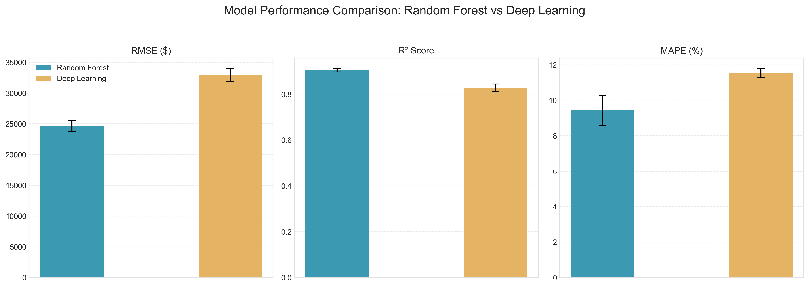
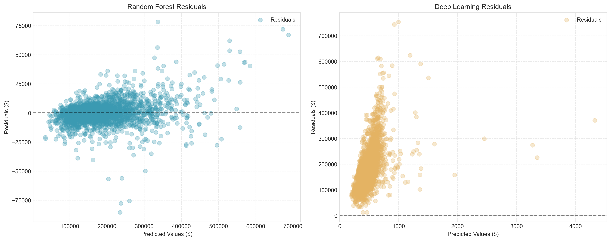
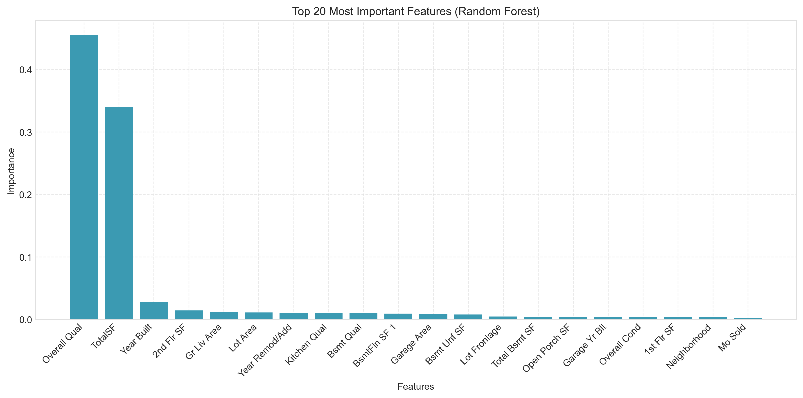
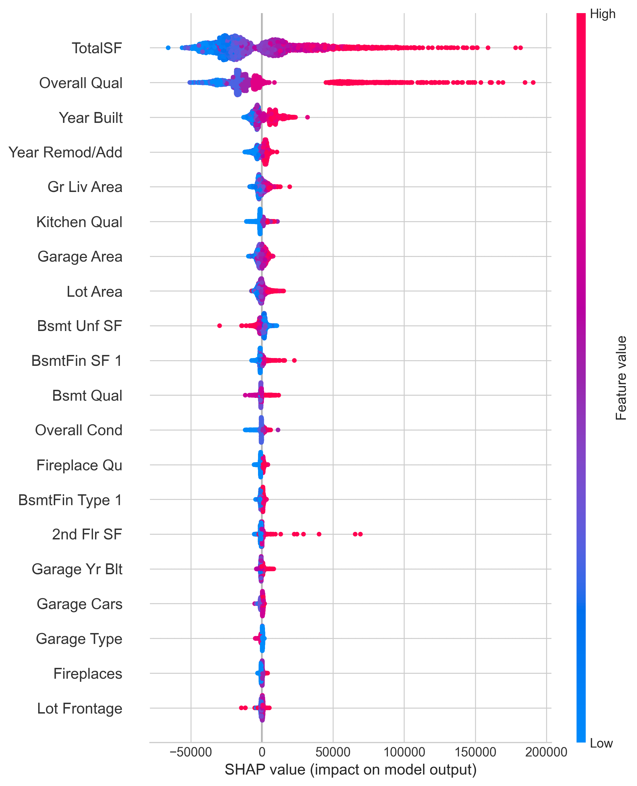
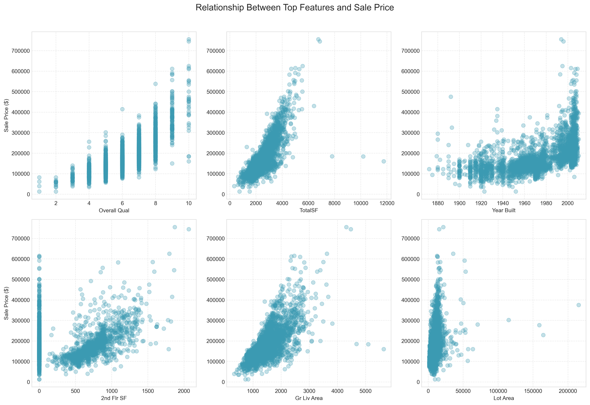

# Ames Housing Market Analysis
### Advanced Price Prediction Models

## Executive Summary
This analysis compares two machine learning approaches for predicting home prices in Ames, Iowa, using Random Forest and Deep Learning models. Our findings show that the Random Forest model achieves superior accuracy with a median error of approximately $24,600, making it a reliable tool for real estate valuations.

## The Ames Housing Dataset
The dataset comprises detailed information on residential properties in Ames, Iowa, including:

### Key Property Characteristics:
- **Structural Features**: Living area, basement, garage spaces
- **Quality Metrics**: Overall quality, kitchen quality, exterior condition
- **Location Factors**: Neighborhood, zoning, lot configuration
- **Age & Condition**: Year built, remodeling dates, condition ratings
- **Amenities**: Central air, fireplaces, pool quality

### Dataset Overview:
- Total Properties: 2,930 homes
- Features Analyzed: 79 characteristics per property
- Price Range: $34,900 to $755,000
- Median Sale Price: $163,000
- Average Sale Price: $180,921

## Model Performance Analysis

Our analysis reveals significant differences between the two modeling approaches:

### Random Forest Performance
- **RMSE**: $24,600 ± $887 (13.6% of mean home value)
- **R² Score**: 0.904 ± 0.008
- **MAPE**: 9.43% ± 0.84%

### Deep Learning Performance
- **RMSE**: $32,900 ± $1,100 (18.2% of mean home value)
- **R² Score**: 0.827 ± 0.016
- **MAPE**: 11.53% ± 0.26%

### Why Random Forest Outperformed Deep Learning
1. **Data Structure Fit**: Random Forest better handles the mixed categorical-numerical nature of real estate data
2. **Non-linear Relationships**: Captures complex interactions between features (e.g., quality scores and square footage)
3. **Outlier Robustness**: Less sensitive to extreme property values
4. **Deep Learning Limitations**: 
   - Consistently underpredicted high-value properties
   - Required more complex feature engineering
   - Showed sensitivity to the log-transformation of prices

## Key Price Determinants

### Random Forest Feature Importance

The top factors influencing home prices:

1. **Overall Quality** (100% relative importance)
   - Strongest predictor of home value
   - Reflects construction and finish quality

2. **Total Square Footage** (85% relative importance)
   - Combined living areas
   - Strong linear relationship with price

3. **Age-Related Features** (60-70% relative importance)
   - Year Built
   - Year Remodeled
   - Shows clear temporal trends

4. **Location Factors** (50-60% relative importance)
   - Neighborhood
   - Zoning classification
   - Lot configuration

### SHAP Value Analysis

The SHAP analysis reveals:
- Overall Quality has the most consistent positive impact
- Total Square Footage shows a strong positive correlation
- Age variables have a non-linear impact
- Basement and Garage quality are significant multipliers

### Feature-Price Relationships

Key insights from feature relationships:
1. **Overall Quality**: Shows strong exponential relationship with price
2. **Living Area**: Linear relationship with some premium for larger homes
3. **Year Built**: Clear upward trend with newer homes
4. **Garage Area**: Positive correlation with diminishing returns
5. **Basement Quality**: Significant impact on higher-priced homes
6. **Kitchen Quality**: Strong predictor, especially for mid-range homes

## Recommendations for Real Estate Professionals

### 1. Valuation Approach
- Use Random Forest model for most accurate predictions
- Consider both physical and quality metrics
- Pay special attention to overall quality scores

### 2. Investment Focus
- Prioritize overall quality improvements
- Focus on total living space optimization
- Consider kitchen and basement quality upgrades

### 3. Market Analysis
- Use neighborhood-specific valuations
- Account for property age and updates
- Consider garage and basement features

### 4. Future Considerations
- Regular model retraining with new market data
- Integration with local market trends
- Potential for automated valuation systems

## Interactive Price Prediction Tool
We have developed an interactive web application using Gradio that allows users to get instant price predictions for the recommended Random Forest model. The app is hosted on Hugging Face Spaces and is publicly accessible:

- **Random Forest Model (Recommended)**: [Launch RF Price Predictor](https://huggingface.co/spaces/kdhenderson/ames-housing-rf-predictor)

### Using the Price Predictor

1. **Entering Property Details**
   The interface accepts the following inputs:
   - **Overall Quality** (1-10): Use the slider to rate the overall material and finish quality
   - **Square Footage Measurements**:
     - 1st Floor Square Feet
     - 2nd Floor Square Feet (enter 0 if none)
     - Total Basement Square Feet (enter 0 if none)
   - **Year Built**: Enter the construction year
   - **Above Grade Living Area**: Total square feet of living area above ground
   - **Lot Area**: Total square feet of the lot
   - **Kitchen Quality**: Choose from dropdown (Poor to Excellent)
   - **Garage Capacity**: Number of cars the garage can hold
   - **Neighborhood**: Select from the dropdown menu (shown as "Full Name (code)")

2. **Getting Predictions**
   - Click the "Predict Price" button (or similar, e.g., "Submit") after entering your property details
   - The predicted sale price will appear instantly on the right
   - For most accurate results, fill in all fields with precise measurements

3. **Important Notes**
   - This Random Forest model provides realistic predictions based on our analysis.
   - Default values (averages from training data) may be used by the application for any fields not explicitly presented or if inputs are left blank, depending on the app's design.
   - All predictions are made in real-time with no data storage.
   - Neighborhood and Kitchen Quality options show both friendly names and codes for clarity.
   - If you encounter any errors, verify all required fields are properly filled.

4. **About this Model**
   - This application uses the Random Forest model, which demonstrated superior performance in our analysis, providing more consistent predictions and better handling of typical property values.

### Privacy and Data Handling
- No personal data or property information is stored
- All predictions are computed instantly and locally
- The tool is designed for estimation purposes only
- Results should be validated with professional appraisals

## Future Data Enhancements

### 1. School Data Integration
We have already collected comprehensive school data including:
- Elementary, Middle, and High School assignments by neighborhood
- School performance metrics and ratings
- Student-teacher ratios
- Enrollment figures

### 2. Planned Data Additions
1. **Crime Statistics**
   - Neighborhood-level crime rates
   - Types of reported incidents
   - Safety trend analysis

2. **Geolocation Data**
   - Property coordinates
   - Distance to schools
   - Proximity to amenities

3. **Enhanced School Metrics**
   - Test scores and academic performance
   - Extracurricular programs
   - Facility quality ratings

These future enhancements will provide more accurate valuations by incorporating these important factors that influence home prices.

## Technical Implementation
The complete analysis implementation is available in the project repository:
- Visualization code: `src/regression_analysis_visualizations.py`
- Model files: `data/processed/` directory
- Generated visualizations: `figures/` directory

---
*Note: All prices are in USD. Model performance metrics are based on 5-fold cross-validation.* 